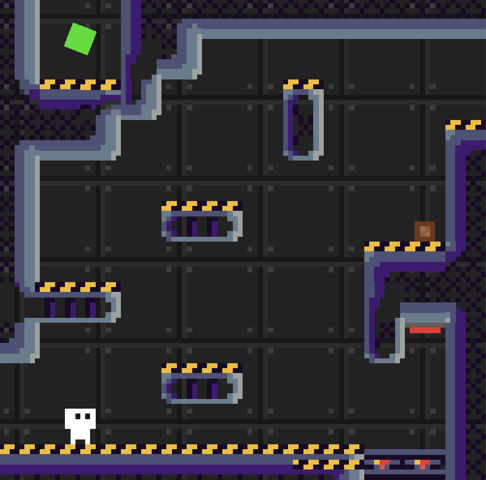

# Klein
This game is a puzzle platformer where the world loops around, but flips, similar to the behavior of a Mobiüs strip, but along both the horizontal and vertical axes.

This game was created with Godot for the 2025 GMTK Game Jam.

It can be played online (and rated for the duration of jam game ratings) at the itch.io page:
https://omnikar.itch.io/klein

